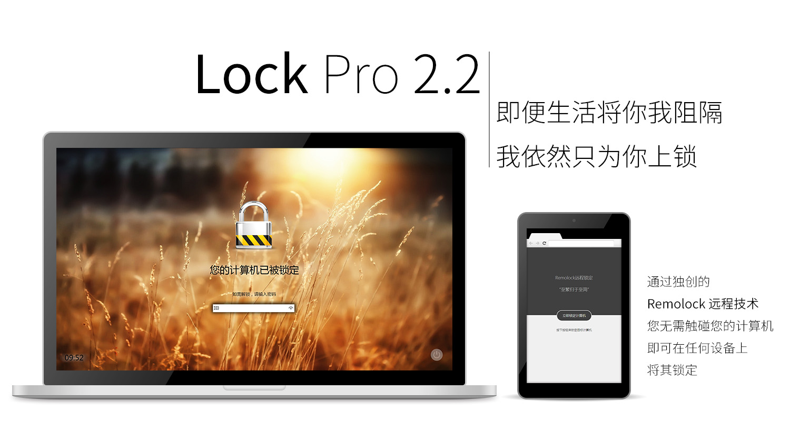

# Lock Pro

A screen locker, completed in July 2013 to October 2015.

Lock Pro, MaxXSoft (曼软软件工作室) 旗下招牌软件, 最初版本可能 2012 年末就出现了, 后来从 2013 年一路发展, 维护至 2015 年.

说是“工作室”, 但其实 MaxXSoft 里只有 MaxXing 一个人在真正写代码, 其他人都是 MaxXing 的朋友们, 被拉来凑数 (虽然之后他们基本都在从事计算机软件开发相关的工作). 这也是为什么我常用的 ID 要么是 MaxXing, 要么是 MaxXSoft.

这个软件是我用 VB6 开发过的最复杂的软件了. 它有正经的安装/卸载程序, 完善的使用向导, 超出人们对 VB6 认知的 GUI, 强大的功能 (真的吗), 基于 MaxXSoft.net 服务器的自动更新程序, 等等. 最重要的是, 它曾经真的有一些 (我也不知道具体多少) 用户.

我也在这个软件的开发过程中投入了很多精力, 设想的若干次架构升级, 比如基于 Direct UI 理念的 Naree UI, 动画系统, plugin 系统, 更安全的加密机制等等, 很多只是刚刚起了个头, 我就放弃 VB6 全面转向 C++ 了.

值得说明的是, 我开始尝试接触编译器和高级语言虚拟机的契机正是 plugin 系统. 我那个时候希望自己设计一门编程语言, 然后实现一个能作为 plugin 的脚本引擎的 runtime, 集成在 Lock Pro 里. 结果 Lock Pro 荒废很多年了, 我也从此走上了一条不归路. 非常怀念那段在知乎刷 [R 大](https://www.zhihu.com/people/rednaxelafx)的回答和文章的时间.

**愿热爱和代码永存.**

## 彩蛋

在 Lock Pro 的关于界面双击 10 次以上会出现彩蛋.

彩蛋的内容和初中/高中那段时间的暗恋对象有关, 有些不好意思解释, 就不贴图了.

## Copyright and License

Copyright (C) 2013-2015 MaxXSoft (MaxXing). License GPLv3.
